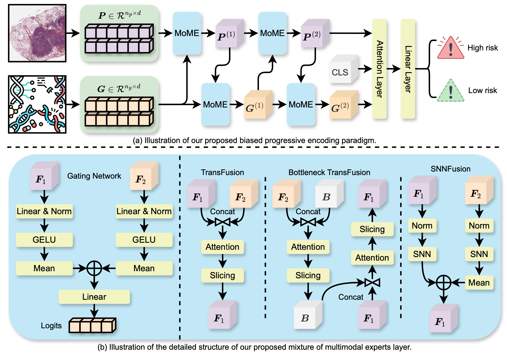

MoME: Mixture of Multimodal Experts for Cancer Survival Prediction (Early Accepted to MICCAI-2024)
===========
[Conghao Xiong](https://bearcleverproud.github.io/), [Hao Chen](https://cse.hkust.edu.hk/~jhc/), [Hao Zheng](https://scholar.google.com.hk/citations?user=LsJVCSoAAAAJ&hl=zh-CN), [Dong Wei](https://scholar.google.com.hk/citations?hl=zh-CN&user=njMpTPwAAAAJ), [Yefeng Zheng](https://sites.google.com/site/yefengzheng/), [Joseph J. Y. Sung](https://www.ntu.edu.sg/about-us/leadership-organisation/profiles/professor-joseph-sung) and [Irwin King](https://www.cse.cuhk.edu.hk/irwin.king/home)

[ArXiv](https://arxiv.org/abs/2406.09696) | MICCAI link is not available at current stage



**Abstract:** Survival analysis, as a challenging task, requires integrating Whole Slide Images (WSIs) and genomic data for comprehensive decision-making. There are two main challenges in this task: significant heterogeneity and complex inter- and intra-modal interactions between the two modalities. Previous approaches utilize co-attention methods, which fuse features from both modalities only once after separate encoding. However, these approaches are insufficient for modeling the complex task due to the heterogeneous nature between the modalities. To address these issues, we propose a Biased Progressive Encoding (BPE) paradigm, performing encoding and fusion simultaneously. This paradigm uses one modality as a reference when encoding the other. It enables deep fusion of the modalities through multiple alternating iterations, progressively reducing the cross-modal disparities and facilitating complementary interactions. Besides modality heterogeneity, survival analysis involves various biomarkers from WSIs, genomics, and their combinations. The critical biomarkers may exist in different modalities under individual variations, necessitating flexible adaptation of the models to specific scenarios. Therefore, we further propose a Mixture of Multimodal Experts (MoME) layer to dynamically selects tailored experts in each stage of the BPE paradigm. Experts incorporate reference information from another modality to varying degrees, enabling a balanced or biased focus on different modalities during the encoding process. Extensive experimental results demonstrate the superior performance of our method on various datasets, including TCGA-BLCA, TCGA-UCEC and TCGA-LUAD.

## Updates:
* 2024 June 19th: Created this repository and first push. The code is still under organization, so please stay tuned if you are interestd!
* 2024 Aug. 3rd: Uploaded the codes and updated README.

## Pre-requisites:
* Linux (Tested on Ubuntu 18.04)
* NVIDIA GPU (Tested on V100)

## Dependencies:
```bash
torch
torchvision
scikit-survival
numpy
h5py
scipy
scikit-learning
pandas
nystrom_attention
admin_torch
```

## Preprocessing
Thanks to the great work of [CLAM](https://github.com/mahmoodlab/CLAM/tree/master). In this step, we used codes of [CLAM](https://github.com/mahmoodlab/CLAM/tree/master). Please refer to their original repository on how to process your WSIs into features.

The data used for training, validation and testing are expected to be organized as follows:
```bash
DATA_ROOT_DIR/
    ├──DATASET_1_DATA_DIR/
        └── pt_files
                ├── slide_1.pt
                ├── slide_2.pt
                └── ...
    ├──DATASET_2_DATA_DIR/
        └── pt_files
                ├── slide_a.pt
                ├── slide_b.pt
                └── ...
    └──DATASET_3_DATA_DIR/
        └── pt_files
                ├── slide_i.pt
                ├── slide_ii.pt
                └── ...
    └── ...
```

### Training Splits and Genomic Data
The split files and genomic data are from [MCAT](https://github.com/mahmoodlab/MCAT/tree/master). To save space of this repository, please download the preprocessed genomics and splits from [MCAT](https://github.com/mahmoodlab/MCAT/tree/master) and put the folders within this project.

### GPU Training on TCGA-UCEC Dataset Using Our Default Settings
Run the following script:
``` shell
CUDA_VISIBLE_DEVICES=0 python3 main.py --data_root_dir FEATURE_DIR --split_dir tcga_ucec --model_type mome --apply_sig --n_bottlenecks 2
```

If you would like to conduct experiments on different datasets, simply replace the `FEATURE_DIR` and `tcga_ucec` with your desired datasets.

### GPU Training Using Bash
Alternatively, if you would like to run multiple experiments, you can run the following script:
``` shell
sh run_batch_experiments.sh
```

This script will automatically use three GPUs to run all three experiments mentioned in our paper simultaneously.

## Issues
- Please report all issues on GitHub.

## Acknowledgement
This repository is built upon [CLAM](https://github.com/mahmoodlab/CLAM/tree/master), [MCAT](https://github.com/mahmoodlab/MCAT/tree/master) and [MOTCat](https://github.com/Innse/MOTCat). Thanks again for their great works!

## Reference
If you find our work useful in your research or if you use parts of this code please consider citing our [paper](https://arxiv.org/abs/2406.09696):

```
@article{xiong2024mome,
  title={MoME: Mixture of Multimodal Experts for Cancer Survival Prediction},
  author={Xiong, Conghao and Chen, Hao and Zheng, Hao and Wei, Dong and Zheng, Yefeng and Sung, Joseph JY and King, Irwin},
  journal={arXiv preprint arXiv:2406.09696},
  year={2024}
}
```
